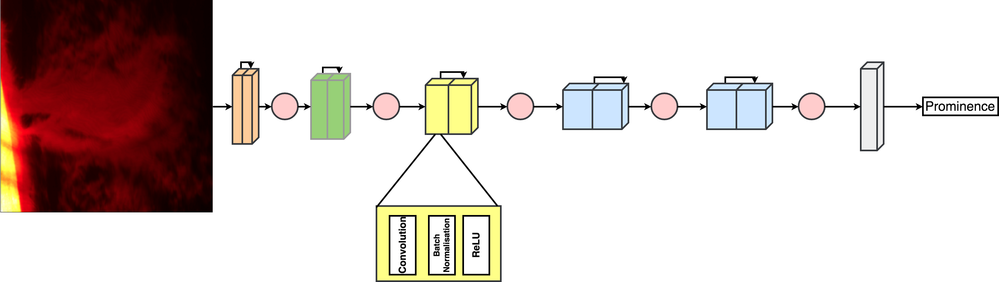
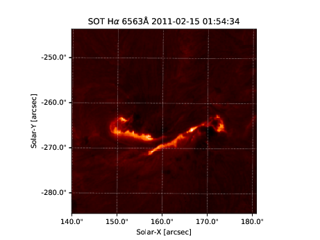
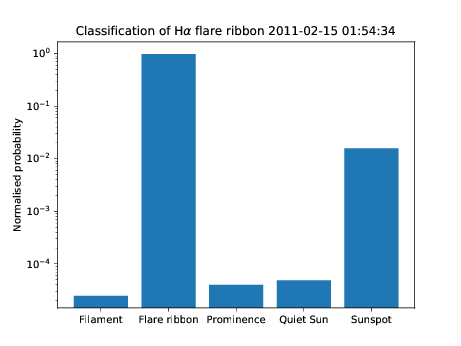

# Slic: Solar Image Classification using Convolutional Neural Networks

Slic is a fast image classification tool for identifying the large-scale features in a solar dataset. It is based on the [VGG-13 convolutional neural network](https://arxiv.org/abs/1409.1556) (CNN) and has the following architecture:

where the coloured blocks refer to the convolutional feature detection layers with an increasing number of feature maps from left to right with the red circles between pairs of convolutional layers indicating maxpooling.

The grey block at the end is the classifier and consists of two fully-connected blocks along with dropout regularisation:

The output of the network is likelihood of the image containing a specific feature which is then modelled by the softmax distribution to give us the feature it is most likely to contain.

The initial training of Slic is done on H&alpha; &lambda;6563&#8491; data from Hinode/SOT (Solar Optical Telescope; [data available here](http://sdc.uio.no/sdc/)) and the training set consists of 13175 images split 90% to 10% for training to validation consisting of five features: filaments, flare ribbons, prominences, sunspots and the quiet Sun (i.e. the lack of any of the other four features).

**Note: filaments and prominences are the same physical feature but are geometrically different so are treated as different classes here.**

We provide a pre-trained model trained for 5 epochs and a learning rate of &eta;=0.0005 that reaches an accuracy of 99.92%. This will be good enough for identifying these features in visible wavelengths. We provide an example notebook of how to use this tool for dataset traversal and give instructions on how to train from scratch if needed.

## Requirements
For training:

* NVIDIA GPU
* CUDA 9.0+
* `Python 3`+
* `numpy`
* `matplotlib`
* `scipy`
* `astropy`
* `scikit-image`
* `pandas`
* `tqdm`
* `PyTorch 0.4+`

For prediction:

* `Python 3`+
* `PyTorch 0.4+`
* `numpy`
* `matplotlib`
* `astropy`
* `scikit-image`
* `tqdm`

Optional:

* `sunpy`
* `palettable`

## Usage
### Training
The file `data.py` contains a prep function for directories of data which reads in directories of fits files and reshapes the image to 256x256 (the input shape of the network), flattens the image and inserts a value corresponding to the label in that image. This can be done by import the function `train_test_data` from `data.py` or running

`python data.py --dataset "path/to/dataset/" --percent_split 10 --save_dir "path/to/save/"`

The `train_test_data` function will save two `.npz` files [(see documentation here for how the file format works)](https://docs.scipy.org/doc/numpy/reference/generated/numpy.savez_compressed.html#numpy.savez_compressed): one for trainign and one for validation.

Then we want to train the moddel now that the data has been prepped. We want to use the `train.py` file for this. Within `train.py`, we have functions for training and validating the model and an example of how to use these by calling the file as

`python train.py`

followed by any keyword arguments to be passed to the file. The model can also be trained by import `train` and `validate` from `train.py` but will require also importing `solar_classifier` from `model.py` and `solar_dataset` from `dataset.py` and then setting up the PyTorch model and loading the data into a PyTorch DataLoader (all of which is done implicitly when running `train.py`).

### Testing
A Jupyter notebook `testing_example.ipynb` has been provided with this repository to illustrate how to use this classifier for predictions on unseen data. With the release of this code we have included the trained model, a file called `sol_class_4.pth` which will need to be used to load the model in our example notebook.

An example of classification is shown below.

 

### Release
We have included the pre-trained model with >99% accuracy - `sol_class_4.pth`. Alongside the prepped training and validation set that we used - named `solar_train_data.npz` and `solar_test_data.npz`, repectively.

## Publications
["Fast Solar Image Classification Using Deep Learning and its Importance for Automation in Solar Physics"](https://link.springer.com/article/10.1007%2Fs11207-019-1473-z), **J.A. Armstrong** and L. Fletcher, *Solar Physics*, vol. 294:80, (2019). [[doi]](https://doi.org/10.1007/s11207-019-1473-z) [arXiv](https://arxiv.org/abs/1905.13575)
